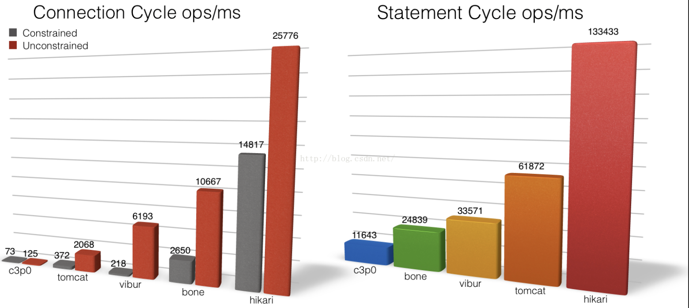
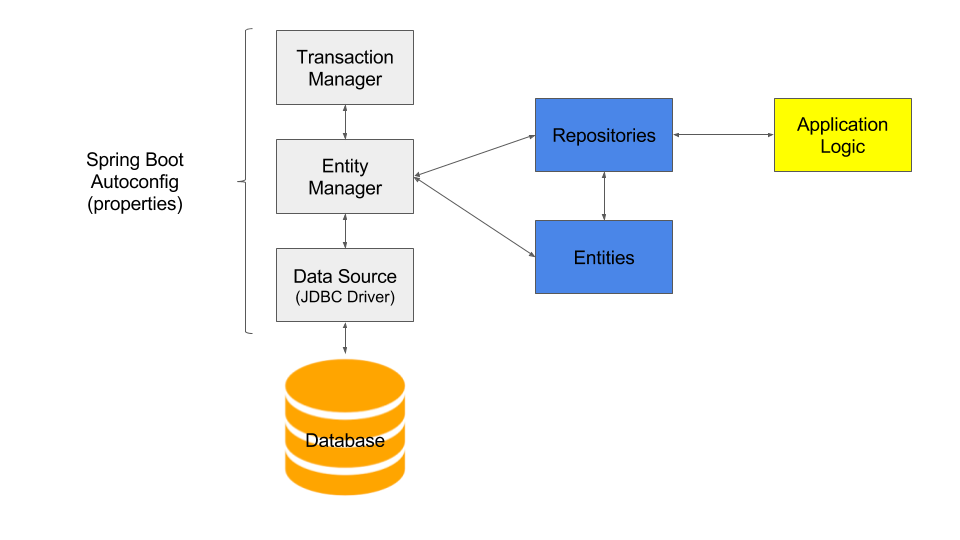
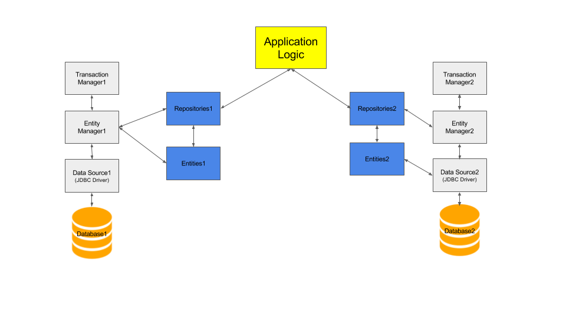

## repo迁移：
> https://github.com/dean-coding/java-framework-started-awesome/tree/by-springboot1.5.18/springboot-hikaricp

## springboot+hikariCP 连接池

 

hikariCP官网: 
		
		http://brettwooldridge.github.io/HikariCP/

在引入spring-boot-starter-jdbc后，内部包含了tomcat-jdbc包，里面有tomcat连接池.然后通过自动配置DataSourceAutoConfigurer创建DataSource对象。

SpringBoot创建默认DataSource时，规则如下：

优先寻找创建Tomcat连接池
如果没有Tomcat连接池，会查找创建HikariCP
如果没有HikariCP连接池，会查找创建dbcp
如果没有dbcp连接池，会查找创建dbcp2
可以使用spring.datasource.type属性指定连接池类型

	spring:
	  datasource:
	    type: com.zaxxer.hikari.HikariDataSource
	    
##
 	    
	    
application-single.yml
	
	spring:
	  datasource:
	    type: com.zaxxer.hikari.HikariDataSource
	    username: root
	    password: root
	    driver-class-name: com.mysql.jdbc.Driver
	    url: jdbc:mysql://${MYSQL_HOST:localhost}:${MYSQL_PORT:3306}/hikaricp?createDatabaseIfNotExist=true&amp;amp;useUnicode=true&amp;amp;characterEncoding=utf-8mb4&amp;amp;autoReconnect=true&useSSL=false
	    hikari:
	      max-lifetime: 2000000
	      maximum-pool-size: 5
	      minimum-idle: 3
	      auto-commit: true
	      connection-timeout: 30000
	
## springboot+hikariCP 连接池,多数据源	 

 

application-multi.yml

	multidb:
	  datasources:
	    db1:
	      jdbc-url: jdbc:mysql://${MYSQL_HOST:localhost}:${MYSQL_PORT:3306}/hikaricp?createDatabaseIfNotExist=true&amp;amp;useUnicode=true&amp;amp;characterEncoding=utf-8mb4&amp;amp;autoReconnect=true&useSSL=false
	      username: root
	      password: root
	      driver-class-name: com.mysql.jdbc.Driver
	      max-lifetime: 2000000
	      maximum-pool-size: 5
	      minimum-idle: 3
	      auto-commit: true
	      connection-timeout: 30000
	    db2:
	      jdbc-url: jdbc:mysql://${MYSQL_HOST:localhost}:${MYSQL_PORT:3307}/hikaricp?createDatabaseIfNotExist=true&amp;amp;useUnicode=true&amp;amp;characterEncoding=utf-8mb4&amp;amp;autoReconnect=true&useSSL=false
	      username: root
	      password: root
	      driver-class-name: com.mysql.jdbc.Driver
	      max-lifetime: 2000000
	      maximum-pool-size: 5
	      minimum-idle: 3
	      auto-commit: true
	      connection-timeout: 30000

DataSource1Config

	@Configuration
	@Profile("multi")
	@EnableJpaRepositories(basePackages = {
			"com.rangers.dbsource.db1.repo" }, entityManagerFactoryRef = "entityManagerFactory1", transactionManagerRef = "transactionManager1")
	@EnableTransactionManagement
	public class DataSource1Config {

	@Primary
	@Bean("datasource1")
	@Qualifier("datasource1")
	 @ConfigurationProperties(prefix = "multidb.datasources.db1")
	public DataSource dataSource1() {
		return DataSourceBuilder.create().type(HikariDataSource.class).build();
	}

	@Bean(name = "entityManagerFactory1")
	@Primary
	public LocalContainerEntityManagerFactoryBean entityManagerFactory1(EntityManagerFactoryBuilder builder,
			JpaProperties jpaProperties) {

		DataSource dataSource1 = dataSource1();
		return builder.dataSource(dataSource1).properties(jpaProperties.getHibernateProperties(dataSource1))
				.packages("com.rangers.dbsource.db1").persistenceUnit("db1").build();

	}

	@Bean(name = "transactionManager1")
	@Primary
	public PlatformTransactionManager transactionManager1(EntityManagerFactoryBuilder builder,
			JpaProperties jpaProperties) {
		return new JpaTransactionManager(entityManagerFactory1(builder, jpaProperties).getObject());
	}
    }  
  
DataSource2Config

	@Configuration
	@Profile("multi")
	@EnableJpaRepositories(basePackages = {
			"com.rangers.dbsource.db2.repo" }, entityManagerFactoryRef = "entityManagerFactory2", transactionManagerRef = "transactionManager2")
	@EnableTransactionManagement
	public class DataSource2Config {

	@Bean("datasource2")
	@Qualifier("datasource2")
	@ConfigurationProperties(prefix = "multidb.datasources.db2")
	public DataSource dataSource2() {
		return DataSourceBuilder.create().type(HikariDataSource.class).build();
	}

	@Bean(name = "entityManagerFactory2")
	public LocalContainerEntityManagerFactoryBean entityManagerFactory2(EntityManagerFactoryBuilder builder,
			JpaProperties jpaProperties) {

		DataSource dataSource2 = dataSource2();
		return builder.dataSource(dataSource2).properties(jpaProperties.getHibernateProperties(dataSource2))
				.packages("com.rangers.dbsource.db2").persistenceUnit("db2").build();

	}

	@Bean(name = "transactionManager2")
	public PlatformTransactionManager transactionManager2(EntityManagerFactoryBuilder builder,
			JpaProperties jpaProperties) {
		return new JpaTransactionManager(entityManagerFactory2(builder, jpaProperties).getObject());
	}
    }
  
  
## 执行测试
